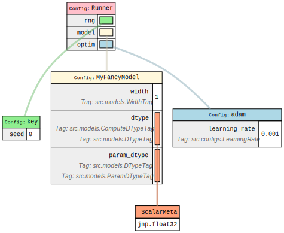

# Fiddle Demo

This demo tries to demonstrate most of the features of the Fiddle configuration library.

First, you'll notice that Fiddle stays out of the way of your "business" code. You can generally write config files configuring regular Python classes/functions without touching the code. This is extremely valuable to glue together libraries that might use different configuration systems. Fiddle can configure anything; there is no need to decorate
the target function (Gin), nor create special dataclasses to glue your config with your Python code (Hydra).

The only exception to this rule that you'll see in the demo is the use of Fiddle tags through type annotations. With the `Annotated` type, you can tag certain variables in your code with Fiddle tags. This makes it so you can later query and replace these tags throughout your config. These `Annotated` types don't affect your code at all, and they could
be removed or added without changing the behavior of your code.

## Outline

This demo has a `Runner` dataclass with all the fields necessary to train a model.
You'll configure runners with Fiddle in `configs.py` and then run them with `main.py`.
Generally, your config files define tags, base configs, fiddlers, and, optionally, sweeps.
This keeps all your config in one place and makes it easy to run different experiments.

## Serialization & Representing your Configs

One of the biggest problems with configuration systems is that you might want to keep around a configuration that you ran and could reload later.
In the worst-case scenario, your code might have changed substantially, and you might be unable to reload your config. In this case, you should be able to perform "surgery" on your config to get it in a working condition with your updated codebase. With typical configuration systems, this isn't easy, but Fiddle makes this process easy!
Fiddle provides numerous ways to serialize your config:

- A JSON format safer than Pickle and more robust to changes in the
  interpreter version.
- A Python config file. From a configuration, Fiddle can generate the Python code that would create that config. This is useful for debugging and performing "surgery" on your config in cases where your code might have changed. You can keep a Python config file in your experiment log and always be confident you can reload and recreate this configuration.
- A "dot notation" representation, which can help log your config to experiment trackers like Aim or Weights & Biases. Most experiment trackers expect this format to be able to filter jobs later.
- A graph representation. Fiddle can create a graph using graphviz so you can easily visualize and debug your configurations. You'd be surprised how useful this can be.



## Flags Parser

The Fiddle flags parser can:

- Specify a base config with `--runner config:NAME`, e.g., `--runner config:base`.
  NOTE: You can pass arguments on the command line to your base config, e.g.,
  `--runner config:base(2)` in our case will set the seed to 2.
- Specify a Fiddler (a function which mutates a base config), e.g.,
  `--runner fiddler:adamw --runner fiddler:half_precision`.
  When specifying a fiddler, Fiddle will look up the function and apply it to the config.
- Override specific variables in the config, e.g., `--runner set:model.width=8`.
  This uses a dot syntax, and you can use any literals that can be parsed with `ast.literal_eval`.

NOTE: You can create multiple Fiddle flag parsers. For example, you can have a runner config and an eval config.
e.g., `--runner config:pvn --eval config:dqn`.

NOTE: You don't have to be locked into a single config module with the Fiddle flag parser. You can specify
a Python module on the CLI to load a config, e.g., `--runner config:src.gpt5.configs:base`.

Some example commands are:

```
# Run the base config
python -m src.main --runner config:base

# Run the base config with half-precision
python -m src.main --runner config:base \
    --runner fiddler:half_precision

# Run the base config with half-precision and AdamW
python -m src.main --runner config:base \
    --runner fiddler:half_precision \
    --runner fiddler:adamw

# Run the base config with a different seed
python -m src.main --runner config:base(2)
```

## Auto Configuration

At first glance Fiddle can seem fairly verbose having to wrap everything with `fdl.Config`.
However, Fiddle provides a `auto_config` decorator that will automatically perform this wrapping for you.
You can just write regular Python code and Fiddle will take care of all the heavy lifting for you.
For example,

```py
def base() -> fdl.Config[Runner]:
    return fdl.Config(
        Runner,
        ...
    )
```

can be written as

```py
@auto_config.auto_config
def base() -> Runner:
    return Runner(
        ...
    )
```

With `auto_config` you can write regular Python code and Fiddle will parse the structure of your config from the AST!

## Mutating Configurations

Generally a function which mutates a base configuration is called a Fiddler.
Fiddlers do need to be written with `fdl.Config` (I'm not sure why this is, I should ask).
You can chain Fiddlers on the command line and they'll be applied in the order they're specified.

To make life easier Fiddle has a `selector` function that makes it so you can query the graph structure
of your config for a certain class or function or tag.
Once these nodes have been resolved you can replace them with other configurables.
For example,

```py
import fiddle as fdl
from fiddle import selectors

def adamw(cfg: fdl.Config[Runner]):
  selectors.select(cfg, optax.GradientTransformation).replace(
    fdl.Config(optax.adamw)
  )
```

You can also use dot notation to replace parts of the config without using selectors:

```py
def adamw(cfg: fdl.Config[Runner]):
  runner.optim = fdl.Config(optax.adamw)
```

Selectors can be very useful in circumstances where you have multiple tags
at arbitrary locations in your config. For example, you might have a `dtype`
tag that you want to replace with `jnp.float16` or `jnp.float32` depending
on whether you're running in half-precision or not. You can use selectors
to query the graph for all `dtype` tags and replace them with the appropriate
type.

You can also combine the two syntaxes to do more complex replacements.
For example,

```py
def complex_fiddler(cfg: fdl.Config[Runner]):
  selectors.select(cfg.generator, tag=DType).replace(jnp.bfloat16)
  selectors.select(cfg.discriminator, tag=DType).replace(jnp.float32)

  # Tie a common optimizer for both generator and discriminator
  optim = fdl.Config(optax.adamw, ...)

  cfg.generator.optim = optim
  cfg.discriminator.optim = optim
```
